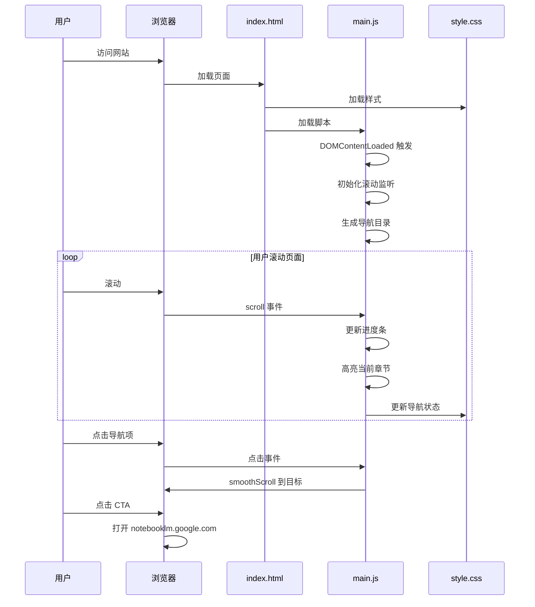

# NotebookLM101 产品需求文档 (PRD)

> **版本**: V1.1 MVP（增强版）
> **日期**: 2026-01-14
> **设计理念**: 现代产品风（10 区块全量内容）

---

## 一、产品路线图

### 核心目标 (Mission)
**打造一个让用户在 5 分钟内全面了解 NotebookLM 价值、并激发立即试用欲望的极致单页教学网站。**

---

### 用户画像 (Persona)

**主要用户**：对 AI 工具感兴趣、但不知道 NotebookLM 或想深入了解的学习者/职场人

**核心痛点**：
- 听说 NotebookLM 很火，但不知道它和 ChatGPT 有什么区别
- 不知道自己是否适合用
- 想快速了解功能，不想啃长文档
- 想看到真实评价，避免踩坑

---

### V1: 最小可行产品 (MVP)

**核心功能列表**：
1. **沉浸式 Hero 区**：一句话定义 + 核心价值主张 + 双 CTA 按钮
2. **顶部阅读进度条**：实时显示阅读位置
3. **智能目录导航**：侧边固定（桌面端）+ 悬浮按钮（移动端）
4. **全量内容展示**：将 source.md 所有内容拆分为 10 个视觉区块
   - Hero 区：吸引注意，激发兴趣
   - 快速入门：30秒感受到震撼
   - 核心功能全景：5 大功能完整展示
   - 适合谁用：6 类用户画像
   - 谁不适合：快速排除法
   - 用户评价：正反面 + 真实金句
   - 常见问题：5 类问题详细解答
   - 竞品对比：vs 通用 AI + vs 传统笔记
   - 使用门槛与入口：官网直达
   - 底部 CTA：最终行动召唤
5. **现代视觉设计**：渐变、卡片、阴影、动效
6. **响应式布局**：完美适配桌面/平板/手机

---

### V2 及以后版本 (Future Releases)

1. 搜索功能：全文关键词搜索
2. 深色模式：一键切换主题
3. 内容折叠：长章节默认折叠，点击展开
4. 分享功能：分享特定段落锚点
5. 互动元素：功能演示 GIF/视频嵌入
6. 多语言支持：英文版
7. 进阶教程页面：提示词技巧、实战案例
8. 用户评论系统：允许读者留言分享经验

---

### 关键业务逻辑 (Business Rules)

| 规则项 | 说明 |
|--------|------|
| 内容呈现 | 按原文结构顺序，不分页，单页滚动 |
| 导航逻辑 | 侧边导航始终可见，点击平滑滚动到对应章节 |
| 阅读进度 | 顶部进度条随滚动实时更新 |
| CTA 策略 | Hero 区 + 每章节底部都有「立即试用」按钮 |
| 响应断点 | 桌面端(>768px)显示侧边导航，移动端底部导航 |

---

### 数据契约 (Data Contract)

| 数据项 | 类型 | 来源 |
|--------|------|------|
| 文章内容 | Markdown | source.md（静态） |
| 章节结构 | Array | 解析 Markdown 标题生成 |
| 滚动位置 | Number | 用户交互产生 |
| 主题偏好 | String（light/dark） | localStorage（V2） |

---

## 二、MVP 原型设计

### 选定方案：现代产品风（增强版）

```
┌──────────────────────────────────────────────────────────────────────┐
│                    ░░░░░░░░░░ 60% 阅读进度 ░░░░░░░░░░                 │
├──────────────────────────────────────────────────────────────────────┤
│                                                                      │
│  ═════════════════════════════════════════════════════════════════  │ ← Hero 区
│  ║                                                                    ║  │
│  ║                    NotebookLM101                                 ║  │
│  ║            目前最接近第二大脑的免费 AI 工具                       ║  │
│  ║                                                                    ║  │
│  ║        ┌────────────┐      ┌─────────────────────────┐          ║  │
│  ║        │  立即了解  │      │   前往试用 →          │          ║  │
│  ║        └────────────┘      └─────────────────────────┘          ║  │
│  ║                                                                    ║  │
│  ═════════════════════════════════════════════════════════════════  │
│                                                                      │
│  ═════════════════════════════════════════════════════════════════  │ ← 快速入门
│  ║                                                                    ║  │
│  ║    ⚡ 30秒感受到震撼                                              ║  │
│  ║    ───────────────────────────────────────────────────────       ║  │
│  ║    随便找一份 20～60 页的 PDF → 点 Audio/Video Overview          ║  │
│  ║    → 听/看 8～15 分钟 → 基本就会被圈粉 😂                        ║  │
│  ║                                                                    ║  │
│  ═════════════════════════════════════════════════════════════════  │
│                                                                      │
│  ┌──────────────────────────────────────────────────────────────┐   │ ← 核心功能全景
│  │                                                              │   │
│  │    🚀 核心功能全景                                            │   │
│  │    ─────────────────────────────────────────────────────      │   │
│  │                                                              │   │
│  │  ┌───────────┐ ┌───────────┐ ┌───────────┐ ┌───────────┐    │   │
│  │  │📚 丰富来源│ │🎙️ AI播客 │ │🎬 AI视频 │ │📊 多模态  │    │   │
│  │  │           │ │           │ │           │ │           │    │   │
│  │  │PDF/Word/  │ │Audio      │ │Video      │ │摘要/表格/ │    │   │
│  │  │YouTube/  │ │Overview   │ │Overview   │ │幻灯片     │    │   │
│  │  │录音...   │ │双人聊天   │ │教学视频   │ │时间轴...  │    │   │
│  │  └───────────┘ └───────────┘ └───────────┘ └───────────┘    │   │
│  │                                                              │   │
│  │  ┌───────────────────────────────────────────────────────┐  │   │
│  │  │ 🔥 2026 新功能                                        │  │   │
│  │  │ 互动式播客 • 完整幻灯片生成 • 深度研究模式            │  │   │
│  │  └───────────────────────────────────────────────────────┘  │   │
│  │                                                              │   │
│  └──────────────────────────────────────────────────────────────┘   │
│                                                                      │
│  ┌──────────────────────────────────────────────────────────────┐   │ ← 适合谁用
│  │                                                              │   │
│  │    👥 适合谁用                                               │   │
│  │    ─────────────────────────────────────────────────────      │   │
│  │                                                              │   │
│  │  ┌──────────┐ ┌──────────┐ ┌──────────┐ ┌──────────┐       │   │
│  │  │👨‍🎓 学生  │ │🔬 研究者 │ │💼 职场人 │ │🎨 创作者 │       │   │
│  │  │期末冲刺  │ │文献综述  │ │汇报效率  │ │内容研究  │       │   │
│  │  │听播客背书│ │精准引用  │ │10h→15min │ │快速理解  │       │   │
│  │  └──────────┘ └──────────┘ └──────────┘ └──────────┘       │   │
│  │                                                              │   │
│  │  ┌──────────┐ ┌──────────┐                                   │   │
│  │  │🌍 外语者 │ │🧠 进阶者 │                                   │   │
│  │  │外文资料  │ │第二大脑  │                                   │   │
│  │  │中文理解  │ │隐私敏感  │                                   │   │
│  │  └──────────┘ └──────────┘                                   │   │
│  │                                                              │   │
│  └──────────────────────────────────────────────────────────────┘   │
│                                                                      │
│  ═════════════════════════════════════════════════════════════════  │ ← 谁不适合
│  ║                                                                    ║  │
│  ║    ❌ 谁其实不太适合                                            ║  │
│  ║    ───────────────────────────────────────────────────────       ║  │
│  ║    • 只想随便聊天、需要实时最新资讯 → 用 ChatGPT/Gemini         ║  │
│  ║    • 完全不上传资料，只想用现成知识                            ║  │
│  ║    • 追求极致排版/专业设计输出                                 ║  │
│  ║                                                                    ║  │
│  ═════════════════════════════════════════════════════════════════  │
│                                                                      │
│  ┌──────────────────────────────────────────────────────────────┐   │ ← 用户评价
│  │                                                              │   │
│  │    💬 用户真实评价                                            │   │
│  │    ─────────────────────────────────────────────────────      │   │
│  │                                                              │   │
│  │    ✅ 吹爆的点（80-90% 正面）                                 │   │
│  │    ┌────────────────────────────────────────────────────┐   │   │
│  │    │ • Audio Overview "震惊""上头""杀疯了"               │   │   │
│  │    │ • 极低幻觉 + 可追溯引用 "汇报时底气十足"            │   │   │
│  │    │ • 多模态输出效率爆炸 "半天变半小时"                  │   │   │
│  │    └────────────────────────────────────────────────────┘   │   │
│  │                                                              │   │
│  │    ⚠️ 吐槽点                                                 │   │
│  │    ┌────────────────────────────────────────────────────┐   │   │
│  │    │ • 聊天记录不持久 • 中文播客偶有"翻译腔"              │   │   │
│  │    │ • 免费版限额 "刚用上瘾就撞墙"                        │   │   │
│  │    └────────────────────────────────────────────────────┘   │   │
│  │                                                              │   │
│  │    💬 真实金句                                               │   │
│  │    "NotebookLM 让我三个月没手动做笔记了"                     │   │
│  │    "职场牛马效率核武器"                                       │   │
│  │                                                              │   │
│  └──────────────────────────────────────────────────────────────┘   │
│                                                                      │
│  ┌──────────────────────────────────────────────────────────────┐   │ ← 常见问题
│  │                                                              │   │
│  │    ❓ 常见问题                                                │   │
│  │    ─────────────────────────────────────────────────────      │   │
│  │                                                              │   │
│  │    ┌────────────────────────────────────────────────────┐   │   │
│  │    │ 📊 使用限制                                          │   │   │
│  │    │ 免费版每天约50次聊天、3次Audio/Video生成             │   │   │
│  │    │ 单个笔记本50个来源，每个来源约50万字                  │   │   │
│  │    ├────────────────────────────────────────────────────┤   │   │
│  │    │ 🎙️ 中文播客质量                                      │   │   │
│  │    │ 2026年已大幅优化，98%像真人，偶有"翻译腔"            │   │   │
│  │    ├────────────────────────────────────────────────────┤   │   │
│  │    │ ⚠️ 功能细节                                          │   │   │
│  │    │ 聊天记录不持久、界面细节待优化                        │   │   │
│  │    ├────────────────────────────────────────────────────┤   │   │
│  │    │ 🔐 隐私与访问                                        │   │   │
│  │    │ 资料不用于训练，需18+验证，部分地区需科学上网         │   │   │
│  │    └────────────────────────────────────────────────────┘   │   │
│  │                                                              │   │
│  └──────────────────────────────────────────────────────────────┘   │
│                                                                      │
│  ┌──────────────────────────────────────────────────────────────┐   │ ← 竞品对比
│  │                                                              │   │
│  │    🆚 竞品对比                                                │   │
│  │    ─────────────────────────────────────────────────────      │   │
│  │                                                              │   │
│  │    vs ChatGPT/Claude/Gemini          vs Notion/Obsidian     │   │
│  │    ┌─────────────────────┐          ┌─────────────────────┐ │   │
│  │    │ ✅ 零幻觉 + 可追溯   │          │ ✅ AI 深度集成     │ │   │
│  │    │ ✅ 多模态输出碾压    │          │ ✅ 大资料杀手      │ │   │
│  │    │ ❌ 不支持实时联网    │          │ ❌ 不适合长期存储  │ │   │
│  │    │ 只吃自家资料，精准！ │          │ 嚼碎机 + 存储库组合 │ │   │
│  │    └─────────────────────┘          └─────────────────────┘ │   │
│  │                                                              │   │
│  └──────────────────────────────────────────────────────────────┘   │
│                                                                      │
│  ═════════════════════════════════════════════════════════════════  │ ← 使用门槛
│  ║                                                                    ║  │
│  ║    🚀 立即开始                                                    ║  │
│  ║    ───────────────────────────────────────────────────────       ║  │
│  ║                                                                    ║  │
│  ║    使用门槛：只要有 Google 账号就能免费使用                       ║  │
│  ║    官网直达：notebooklm.google.com                               ║  │
│  ║                                                                    ║  │
│  ║        ┌─────────────────────────────────────────────┐          ║  │
│  ║        │                                             │          ║  │
│  ║        │         前往 Google 官网试用 →              │          ║  │
│  ║        │                                             │          ║  │
│  ║        └─────────────────────────────────────────────┘          ║  │
│  ║                                                                    ║  │
│  ═════════════════════════════════════════════════════════════════  │
│                                                                      │
└──────────────────────────────────────────────────────────────────────┘

[ 悬浮导航圆钮：●●●○○○ 点击展开目录 ]
```

### 页面结构详解（10 个区块）

| # | 区块名称 | 内容来源 | 设计重点 |
|---|---------|---------|---------|
| 1 | Hero 区 | 核心价值主张 | 大标题、双 CTA、渐变背景 |
| 2 | 快速入门 | source.md 行 52-53 | 吸引眼球，激发好奇心 |
| 3 | 核心功能全景 | source.md 行 7-43 | 5 大功能 + 2026 新功能 |
| 4 | 适合谁用 | source.md 行 59-93 | 6 类用户卡片展示 |
| 5 | 谁不适合 | source.md 行 95-98 | 快速排除，节省时间 |
| 6 | 用户评价 | source.md 行 108-152 | 正反面 + 真实金句 |
| 7 | 常见问题 | source.md 行 156-194 | 5 类问题手风琴展开 |
| 8 | 竞品对比 | source.md 行 196-237 | 双表格对比 |
| 9 | 使用门槛 | source.md 行 49-50 | 官网直达入口 |
| 10 | 底部 CTA | 最终行动召唤 | 大按钮、强引导 |

### 设计说明

**视觉特点**：
- 大标题 Hero 区，双 CTA 按钮（主要：前往试用，次要：立即了解）
- 功能用卡片展示，每个卡片包含：emoji 图标 + 功能名 + 一句话描述
- 用户画像用 3 列卡片布局，突出典型使用场景
- 渐变背景、微阴影、卡片悬浮动效
- 情感化文案，激发试用欲望

**交互特点**：
- 桌面端：左侧固定目录导航，点击平滑滚动
- 移动端：右下角悬浮按钮（FAB），点击展开目录
- 顶部阅读进度条，实时显示阅读位置
- 目录自动高亮当前章节

**色彩系统**：
- 主色：Google Blue (#4285f4)
- 强调色：渐变紫色 (#667eea → #764ba2)
- 背景色：白色 / 浅灰交替

---

## 三、架构设计蓝图

### 核心流程图



### 组件交互说明

**文件结构**：
```
notebooklm101/
├── index.html          # 主页面
│   ├── <div class="progress-bar">      # 进度条组件
│   ├── <aside class="toc">             # 目录导航组件（桌面端）
│   ├── <button class="fab">            # 悬浮导航按钮（移动端）
│   ├── <main>                          # 内容容器
│   │   ├── <section class="hero">              # Hero 区
│   │   ├── <section class="quick-start">       # 快速入门
│   │   ├── <section class="features">          # 核心功能全景
│   │   ├── <section class="users">             # 适合谁用（6类用户）
│   │   ├── <section class="not-suitable">      # 谁不适合
│   │   ├── <section class="reviews">           # 用户评价
│   │   ├── <section class="faq">               # 常见问题（手风琴）
│   │   ├── <section class="compare">           # 竞品对比
│   │   ├── <section class="get-started">       # 使用门槛
│   │   └── <section class="final-cta">         # 底部 CTA
│   └── <footer>                        # 页脚
│
├── css/style.css        # 样式
│   ├── :root { CSS变量 }
│   ├── .progress-bar { 进度条样式 }
│   ├── .hero { Hero 区样式 }
│   ├── .quick-start { 快速入门高亮样式 }
│   ├── .features { 功能卡片网格布局 }
│   ├── .users { 6类用户卡片样式 }
│   ├── .reviews { 评价区块样式 }
│   ├── .faq { 手风琴展开样式 }
│   ├── .compare { 对比表格样式 }
│   ├── .toc { 目录导航样式 }
│   └── @media { 移动端响应式 }
│
└── js/main.js          # 脚本
    ├── initProgressBar()     # 进度条逻辑
    ├── initTOC()             # 目录生成与高亮（10个章节）
    ├── initSmoothScroll()    # 平滑滚动
    ├── initFAQ()             # FAQ 手风琴展开
    └── initMobileNav()       # 移动端导航
```

**调用关系**：
- 用户滚动 → scroll 事件 → main.js 更新进度条/CSS 高亮 → 视觉反馈
- 用户点击导航 → click 事件 → smoothScroll → 页面滚动

### 技术选型与风险

| 技术项 | 选择 | 理由 | 潜在风险 |
|--------|------|------|---------|
| CSS 框架 | 无（纯 CSS） | 轻量、完全控制、无依赖 | 样式代码量大 |
| CSS 特性 | Grid + Flexbox | 现代布局方案 | 旧浏览器不支持 |
| 交互效果 | Vanilla JS | 无需构建，加载快 | 复杂动画需手写 |
| 字体 | 系统字体栈 | 无需加载，原生体验 | 视觉差异化有限 |
| 图标 | Emoji + SVG | 无外部依赖 | 渲染不一致 |

**关键技术决策**：
- 使用 CSS 变量实现主题系统（方便未来扩展深色模式）
- 使用 `scroll-behavior: smooth` 实现平滑滚动
- 使用 `IntersectionObserver` 实现目录高亮

---

## 四、实施计划

### 修改文件清单

| 文件 | 操作 | 说明 |
|------|------|------|
| `index.html` | 重写 | 按现代产品风重构 |
| `css/style.css` | 重写 | 新增卡片、进度条、Hero 区等样式 |
| `js/main.js` | 扩展 | 新增进度条、目录高亮、移动端导航 |
| `source.md` | 保留 | 作为内容源，未来可解析为 HTML |

### 新增功能模块

| 模块 | CSS 类名 | 功能描述 |
|------|---------|---------|
| 进度条 | `.progress-bar` | 顶部固定，3px 渐变色，随滚动百分比变化宽度 |
| 目录导航 | `.toc` | 左侧固定，提取 10 个章节标题，当前章节高亮 |
| 移动端 FAB | `.fab` | 右下角固定圆形按钮，点击展开/收起目录 |
| Hero 区 | `.hero` | 大标题 + 双 CTA + 渐变背景 |
| 快速入门 | `.quick-start` | 高亮背景，吸引注意，简洁展示入门步骤 |
| 功能卡片 | `.feature-card` | Grid 布局，4 列主功能 + 1 行新功能，悬浮放大 |
| 用户卡片 | `.user-card` | Grid 布局，6 类用户，emoji + 标题 + 描述 |
| 排除列表 | `.not-suitable` | 红色叉号图标，简洁列表 |
| 评价区块 | `.reviews` | 分为正面/负面/金句三个子区块 |
| FAQ 手风琴 | `.faq-accordion` | 点击展开/收起，平滑动画 |
| 对比表格 | `.compare-table` | 双表格并排，移动端堆叠 |
| 最终 CTA | `.final-cta` | 大按钮，强引导，呼应 Hero 区 |

**CSS 变量扩展**：
```css
:root {
    /* 现有变量 */
    --color-primary: #4285f4;
    --color-secondary: #34a853;

    /* 新增：区块特定颜色 */
    --color-success: #34a853;    /* 正面评价 */
    --color-warning: #fbbc04;    /* 吐槽点 */
    --color-danger: #ea4335;     /* 不适合 */
    --color-highlight: #f8f9fa;  /* 快速入门背景 */

    /* 新增：间距 */
    --section-padding: 4rem;     /* 区块内边距 */

    /* 新增：卡片样式 */
    --card-border-radius: 12px;
    --card-hover-lift: 4px;
}
```

**JS 功能扩展**：
```javascript
// 新增：FAQ 手风琴
function initFAQ() {
    const faqItems = document.querySelectorAll('.faq-item');
    faqItems.forEach(item => {
        const header = item.querySelector('.faq-header');
        header.addEventListener('click', () => {
            item.classList.toggle('expanded');
        });
    });
}

// 新增：10 个章节导航高亮
const sections = [
    { id: 'hero', title: '首页' },
    { id: 'quick-start', title: '快速入门' },
    { id: 'features', title: '核心功能' },
    { id: 'users', title: '适合谁用' },
    { id: 'not-suitable', title: '谁不适合' },
    { id: 'reviews', title: '用户评价' },
    { id: 'faq', title: '常见问题' },
    { id: 'compare', title: '竞品对比' },
    { id: 'get-started', title: '立即开始' },
    { id: 'final-cta', title: '试用' }
];
```

---

## 五、验收标准

### 功能验收
- [ ] 页面能正常加载，无控制台错误
- [ ] 顶部进度条随滚动实时更新（0-100%）
- [ ] 侧边导航显示 10 个章节，点击平滑滚动
- [ ] 目录自动高亮当前阅读章节
- [ ] 快速入门区块视觉突出，吸引注意
- [ ] 6 类用户卡片正确显示
- [ ] FAQ 手风琴点击可展开/收起
- [ ] 两个对比表格正确渲染
- [ ] 所有 CTA 按钮正确跳转到 notebooklm.google.com
- [ ] 移动端 FAB 能展开/收起目录
- [ ] 移动端导航从左下角滑出

### 内容完整性验收
- [ ] Hero 区：标题 + 副标题 + 双 CTA
- [ ] 快速入门：30秒震撼内容
- [ ] 核心功能：5 大功能 + 2026 新功能
- [ ] 适合谁用：6 类用户完整展示
- [ ] 谁不适合：3 条排除标准
- [ ] 用户评价：正面/负面/金句
- [ ] 常见问题：5 类问题详细解答
- [ ] 竞品对比：vs 通用 AI + vs 传统笔记
- [ ] 使用门槛：Google 账号 + 官网链接
- [ ] 底部 CTA：最终行动召唤

### 视觉验收
- [ ] Hero 区视觉冲击力强，符合现代产品风
- [ ] 10 个区块层次分明，有呼吸感
- [ ] 卡片排版整齐，间距合理
- [ ] 渐变、阴影、动效使用恰当
- [ ] 移动端适配良好，文字可读
- [ ] emoji 图标显示一致

### 性能验收
- [ ] 首屏加载时间 < 1s
- [ ] 滚动流畅，无明显卡顿（60fps）
- [ ] 移动端滑动响应迅速
- [ ] FAQ 展开动画流畅

---

## 六、后续迭代方向

基于 MVP 用户反馈，优先考虑：
1. 如果用户反馈内容太多 → V2 添加内容折叠/分页
2. 如果用户反馈找不到特定信息 → V2 添加搜索功能
3. 如果用户反馈夜间使用不便 → V2 添加深色模式
4. 如果用户反馈想分享给朋友 → V2 添加分享功能

---

**文档状态**: 已锁定（V1.1 增强版），等待开发指令
**下一步**: 开始实施 MVP 开发
**变更记录**: V1.0 → V1.1，扩展为 10 个区块，全量展示 source.md 内容
